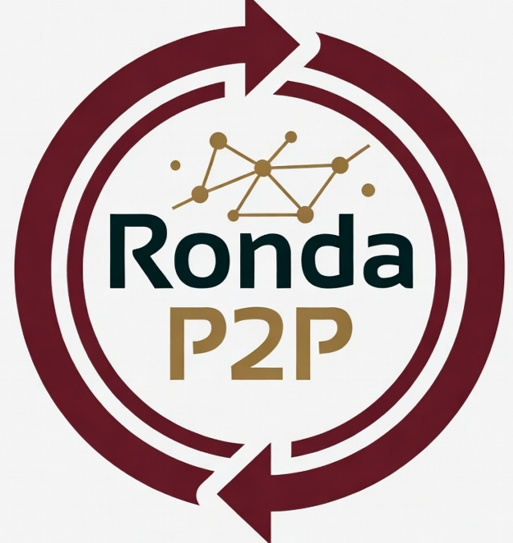

# Plataforma-Kixikila

# >Rede Coletiva de Poupança

Sistema de poupança coletiva que permite criar grupos com amigos e familiares para economizar juntos de forma segura e transparente. Cada membro contribui com um valor definido e o sistema organiza automaticamente a ordem de recebimento.

* A plataforma oferece acompanhamento em tempo real de todos os grupos, sorteios automáticos para definir a ordem dos beneficiários e total segurança nas transações registradas entre os participantes.
